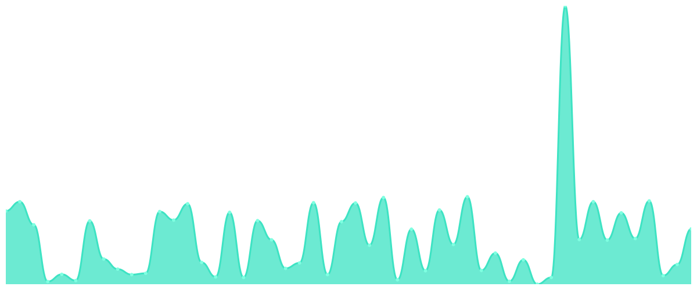

# Uptime

Uptime monitor for my services.

## Status

| URL | Status | Response Time | Uptime |
| --- | ------ | ------------- | ------ |
| Cloverse (lvl 1) | 🟩 Up |  424ms | 100%
| Cloverse (lvl 2) | 🟩 Up |  401ms | 100%
| Cloverse (lvl 3) | 🟩 Up |  406ms | 100%
| Cloverse (lvl 4) | 🟩 Up |  379ms | 100%
| Cloudflare | 🟩 Up |  319ms | 100%
| Heroku | 🟩 Up |  185ms | 100%
| Railway | 🟩 Up |  322ms | 100%
| Github | 🟩 Up |  167ms | 100%
